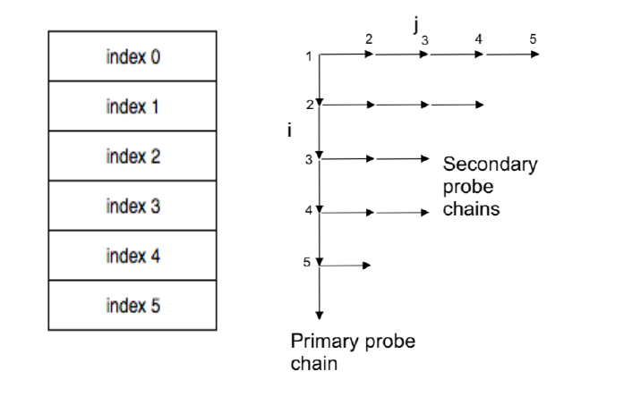
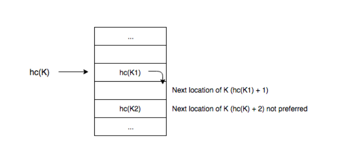

# BRENT’S METHOD HASHING

BrentBrent's Method is a dynamic hashing method which was designed by R.P. Brent in 1973.
Brent hashing was originally developed to make the double-hashing process more efficient,
but it can be successfully applied to any closed hashing process. In the closed hashing
process, all keys are stored in the hash table’s internal array without using linked lists.

The order, in which the algorithm searches the hash table for candidate positions, is referred
to as a "probing sequence" (also called "probe chain”). Brent's idea is to move elements on the
probe chain with small path length. In this way, long probing sequences can be avoided and
the algorithm becomes more efficient and faster. There are two probe chains called primary
and secondary probe chains as shown above.

There may be several records on the primary probe chain. Let j be the number of extra
accesses needed to access a record R, assuming that we choose to move R. Let i be the
number of locations that we must visit to access the record we are inserting, assuming we
move R. As a result we want to choose R such that i + j should be minimum.

Finding i+j with minimum value can be viewed as a search operation in a two dimensional
space. The vertical axis shows the points in the primary probe chain. Each point on the axis is
a location that the key we are inserting hashes to. Each horizontal line is the chain of locations
that each existing record that we are thinking about moving hashes to. If there is no any
element in the index, in which an object is to be placed, indexing is performed without
collision, so there is no need to any intervene. Otherwise you need to do some extra
operations.

Assume that K is a key and the hash function h(K) returns an index. The cases that may occur
while inserting an element:

• If K’s first probe location (index) is empty, just insert K in this index (which is the best
possibility)

• If K’s first probe location is full (collision), and second probe location is empty, just insert
K to this second index

• But suppose increment value of K is 2 and collides with a key K1 at K’s first probe
location and with another key K2 at K’s second location:

 •Think about moving K1 to K1’s next probe location, and putting K in its place

 •If increment value of K1 is 1 and K1’s next location is empty, this will increase
  K1’s successful probe path length by 1
  
Suppose a new key K to be inserted has probe p1 , p2 ,..., pv-1 index sequence.  If v < 3, just insert K in location p as usual; can’t do better than that. For calculating the value mentioned above as the increment value, you should define an incrementing function as well as the hash function as follows: 

Hash Function = hash(key) = key mod M

Incrementing Function = i(key) = Quotient (Key / M) mod M

Note: M is the size of hash table and quotient refers to division process.

